# Awesome-Anomaly-Detection-For-Business-Ops-Metrics

# Awesome-Anomaly-Detection-For-Business-Ops-Metrics 📈 🔍

  

  

  

  

  

  

  

---

## 🌟 Top Anomaly Detection For Business Ops Metrics Ecosystem

**Curated List of Commercial Observability & AIOps Platforms with Open-Source Metric Anomaly Detection Frameworks**  

*Focused on Business KPI Monitoring, Time-Series Outlier Detection, Root Cause Analysis & Self-Hosted Alerting Pipelines*  

**Last updated: October 2026** 📅

---

### 📌 Overview & SEO Summary

Welcome to the ultimate curated directory of **anomaly detection platforms for business and ops metrics**, **open-source time-series outlier detection libraries**, and **AIOps monitoring frameworks**. Whether you are looking for enterprise-grade commercial solutions (such as *Amazon Lookout for Metrics*, *Anodot*, *Datadog Watchdog*, and *Dynatrace Davis*), or self-hostable open-source alternatives (like *Anomstack*, *Prometheus anomaly detection*, *ADTK*, and *Luminol*), this list covers category leaders, algorithm libraries, and privacy-respecting alerting pipelines.

---

## 📑 Table of Contents

- [🏢 SaaS & Commercial Platforms](#-saas--commercial-platforms)

- [🔓 Open-Source GitHub Projects](#-open-source-github-projects)

- [🛠️ How to Contribute](#%EF%B8%8F-how-to-contribute)

- [📊 Star History](#-star-history)

- [🤝 Support & Sponsorship](#-support--sponsorship)

- [⚠️ Disclaimer](#%EF%B8%8F-disclaimer)

---

## 🏢 SaaS / Commercial Platforms

The business metrics anomaly detection market has bifurcated into full-stack observability platforms (Datadog, Dynatrace, Elastic) that bundle anomaly detection with logs, APM, and security, and specialized business KPI monitors (Amazon Lookout, Anodot, Monte Carlo) that focus on revenue, orders, and data quality. Pricing models vary dramatically: Datadog charges per host plus per GB ingested with no commitment , Dynatrace uses per-module consumption pricing with no permanent free tier , Amazon Lookout charges per metric analyzed with tiered pricing starting at $0.75/metric for the first 1,000 metrics , and Anodot requires custom quotes typically ranging from $25,000–$100,000 annually for mid-market deployments .

| SaaS / Commercial Platform | Company / Owner | Valuation / Market Cap | Standard Edition Starting Price | Free Tier / Free Trial Limits | Description |

| :--- | :--- | :--- | :--- | :--- | :--- |

| **[Amazon Lookout for Metrics](https://aws.amazon.com/lookout-for-metrics/)** ☁️ | Amazon | ~$2.0 Trillion | $0.75/metric (first 1,000); tiered down to $0.05/metric (>50K) | **First month free for up to 100 metrics**; no permanent free tier  | **Business KPI anomaly detection** — Automatically detects anomalies in revenue, orders, and customer activity. No ML expertise required. Detects severity and root cause. |

| **[Datadog Watchdog](https://www.datadoghq.com/)** 🐶 | Datadog Inc. | ~$40 Billion | Infrastructure: $15/host/mo; Anomaly Detection included in Enterprise ($23/host/mo) | **14-day free trial**; no permanent free tier  | **Full-stack observability with ML anomaly detection** — Watchdog surfaces anomalies across metrics, APM, and logs. Correlates related anomalies. Bits AI for natural-language querying . |

| **[Dynatrace Davis AI](https://www.dynatrace.com/)** 🔮 | Dynatrace | ~$15 Billion | Custom per-module pricing (Infrastructure, APM, Logs priced separately) | **15-day free trial**; no permanent free tier  | **Deterministic and causal AI for root cause** — Combines Smartscape topology graph with causal AI to point directly at root cause, not just correlated symptoms. Agentic remediation layer . |

| **[Anodot](https://www.anodot.com/)** 📉 | Anodot | Private | Custom quote; mid-market $25,000–$100,000/year  | Free trial available; no permanent free tier | **Autonomous business monitoring** — AI-driven anomaly detection for revenue, costs, and operational metrics. Multi-year discounts of 15–30% commonly negotiated . |

| **[Monte Carlo Data](https://www.montecarlodata.com/)** 🎲 | Monte Carlo | Private | Credit-based consumption; all tiers are "Request pricing"  | No permanent free tier; sales-quoted | **Data observability with anomaly detection** — Monitors data warehouse, BI, ETL pipelines. Incident triage, root cause, and lineage. Up to 10 users on Start plan . |

| **[Sisu Data](https://sisu.ai/)** 📊 | Sisu Data | Private | Starts at ~$18.4/month (per user, estimated)  | No permanent free tier; trial available | **Diagnostic analytics with anomaly detection** — Automatically identifies why metrics change. Explains root causes across high-dimensional data. |

| **[Tellius](https://tellius.com/)** 🎯 | Tellius | Private | Pricing available upon request  | Free trial available | **AI-powered analytics with anomaly detection** — Natural language queries, automated insights, and proactive metric monitoring for business users. |

| **[Outlier AI](https://www.outlier.ai/)** 🧠 | Outlier AI | Private | Free to sign up (contributor model)  | Free platform access | **Crowd-sourced AI training with anomaly detection** — Experts review and label data. Pays contributors $10–$25/hour . |

| **[Elastic Machine Learning](https://www.elastic.co/)** 🔍 | Elastic N.V. | ~$10 Billion | Serverless Security Analytics Essentials: $0.09/GB ingested + $0.017/GB retained/month  | **Free 14-day trial**; 50 GB egress free monthly  | **Anomaly detection integrated into Elasticsearch** — ML jobs for time-series outlier detection, population analysis, and rare event detection. Part of Elastic Security and Observability suites. |

---

## 🔓 Open-Source GitHub Projects

*Sorted by GitHub_Stars_Count (Descending)* 🌟

- **[Anomstack](https://github.com/andrewm4894/anomstack)**   

  **Painless open-source anomaly detection for metrics**, MIT licensed. ~114 stars . End-to-end pipeline: metric ingestion (SQL, Python, APIs), anomaly detection (PyOD, Prophet, custom models), alerting (Slack, email, webhooks), and dashboarding. Docker-based, runs on a schedule (e.g., daily cron). The most complete self-hosted business metric anomaly detection stack available.

- **[PyOD (Python Outlier Detection)](https://github.com/yzhao062/pyod)**   

  **Comprehensive Python toolkit for outlier detection**, BSD-2-Clause licensed. ~8,000+ stars. 50+ detection algorithms including Isolation Forest, LOF, KNN, AutoEncoder, and COPOD. Unified API for benchmarking and deployment. The foundational library for building custom anomaly detection pipelines.

- **[ADTK (Anomaly Detection Toolkit)](https://github.com/arundo/adtk)**   

  **Python toolkit for unsupervised time-series anomaly detection**, MPL-2.0 licensed. ~1,500+ stars. Built for business and ops metrics. Detectors include InterQuartileRange, LevelShift, VolatilityShift, Persist, and Seasonal. Transformers for rolling aggregates and pipelines for multi-stage detection.

- **[Luminol](https://github.com/linkedin/luminol)**   

  **Lightweight anomaly detection and correlation library by LinkedIn**, Apache-2.0 licensed. ~1,100+ stars. Algorithms include Bitmap, Derivative, AbsoluteThreshold, and ExponentialMovingAverage. Correlator for finding related anomalous metrics. Designed for time-series monitoring.

- **[Prometheus Anomaly Detection (LSTM Autoencoder)](https://github.com/vpuhoff/prometheus-anomaly-detection-lstm)**   

  **LSTM autoencoder for Prometheus time-series anomaly detection**, MIT licensed. End-to-end workflow: collect PromQL data, preprocess, train autoencoder, detect anomalies in real-time, expose to Prometheus exporter. Configurable thresholds and sequence lengths .

- **[Random Cut Forest (AWS)](https://github.com/aws/random-cut-forest-by-aws)**   

  **AWS's Random Cut Forest algorithm for anomaly detection**, Apache-2.0 licensed. The same algorithm powering Amazon Lookout for Metrics and SageMaker RCF . Unsupervised, streaming-friendly, and designed for high-dimensional data.

- **[ruptures](https://github.com/deepcharles/ruptures)**   

  **Python library for change point detection**, BSD-2-Clause licensed. ~3,000+ stars. Detects mean shifts, variance changes, and trend breaks in time-series metrics. Algorithms include Pelt, Binseg, BottomUp, and Window. Essential for detecting sustained metric shifts.

- **[STUMPY](https://github.com/TDAmeritrade/stumpy)**   

  **Scalable time-series matrix profile computation**, BSD-3-Clause licensed. ~3,500+ stars. Finds motifs (repeating patterns) and discords (anomalies) in time-series data. Extremely fast for large metric datasets. GPU acceleration available.

- **[Telemanom (NASA)](https://github.com/khundman/telemanom)**   

  **LSTM-based anomaly detection for spacecraft telemetry**, MIT licensed. ~2,000+ stars. Nonparametric, unsupervised approach for detecting anomalies in multivariate time-series without labeled data. Originally developed for NASA JPL mission telemetry.

- **[Merlion](https://github.com/salesforce/Merlion)**   

  **Time-series intelligence library by Salesforce**, BSD-3-Clause licensed. ~4,000+ stars. Unified interface for forecasting, anomaly detection, and change point detection. 20+ models including AutoARIMA, Prophet, Isolation Forest, and Spectral Residual.

- **[Kats](https://github.com/facebookresearch/Kats)**   

  **Facebook's time-series analysis toolkit**, MIT licensed. ~5,500+ stars. Forecasting, detection (CUSUM, Prophet), and feature extraction. Designed for time-series data science workflows.

- **[Alibi Detect](https://github.com/SeldonIO/alibi-detect)**   

  **Algorithms for outlier, adversarial, and drift detection**, Apache-2.0 licensed. ~2,500+ stars. Online and offline detectors for tabular, text, image, and time-series data. Supports TensorFlow, PyTorch, and scikit-learn backends.

- **[Orion (Unsupervised Time Series Anomaly Detection)](https://github.com/sintel-dev/Orion)**   

  **Machine learning library for unsupervised time-series anomaly detection**, MIT licensed. Part of the Sintel project. Automates pipeline selection and hyperparameter tuning. Includes 20+ primitive pipelines for different data characteristics.

---

## 🛠️ How to Contribute

Contributions are welcome! Follow these steps to submit new anomaly detection platforms or open-source metric monitoring software:

1. 🍴 **Fork** the repository.

2. 📝 **Add/edit** entries in `README.md` maintaining table/list structure and formatting.

3. 🔗 Include project title, official website/GitHub link, exact Stars_Count, license, and brief description.

4. 🚀 Submit a **Pull Request** with a descriptive summary of your changes.

---

## 📊 Star History

---

## 🤝 Support & Sponsorship

If you find this anomaly detection repository useful, please consider supporting the project:

- ⭐ **Star** this repository to increase visibility!

- 🔀 **Fork** and share with fellow developers, SREs, and data engineers.

- ☕ **Sponsor & Buy Me a Coffee**: Support ongoing open-source curation via the [GitHub Sponsor Dashboard](https://github.com/sponsors/ishandutta2007).

---

## ⚠️ Disclaimer

- This is a **community-curated** list — not exhaustive and not an endorsement. ℹ️

- Anomaly detection models can produce false positives and false negatives. **Always validate alerts** and tune thresholds before acting on production metrics. 🔒

- Open-source anomaly detection libraries (PyOD, ADTK, Luminol, Anomstack) provide self-hosted ownership and algorithm transparency, but enterprise-grade SLA guarantees, automated root cause correlation, and managed infrastructure remain primarily commercial offerings. 📈

---

  <b>Made with ❤️ for SREs, data engineers, and open-source observability developers.</b>

